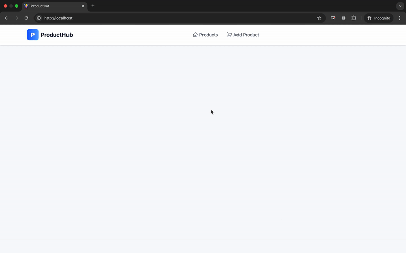

# 🛍️ IKEA Product Management System

I've developed a full-stack product management system with mobile-responsive design 📱. The application features:


---

## 🧰 Tech Stack

- **Frontend**: React 19, Vite 6, Tailwind CSS
  - **Cross-Platform**: Fully responsive layout

- **Backend**:
    - Java 21 with Spring Boot 3.5
    - JPA/Hibernate with MySQL
    - MapStruct 1.6.3 for DTO mapping
    - Lombok 1.18.30 for boilerplate reduction
- **Testing**: JUnit 5, Mockito 5.14.2
- **API Documentation**: Swagger UI
- **Containerization**: Docker, Docker Compose
- **Architecture**: Domain-Driven Design (DDD) principles

---

## 🚀 Set up - Getting Started 

### 1. Clone the Repository

```bash
git clone https://github.com/emil126a/ikea_product_catalogue.git
cd product-catalogue
```

### 2. Run with Docker Compose

To build and start the application:

```bash
docker compose build --no-cache
```

Then:

```bash
docker compose up
```

**That's it! You're done! 🎉** The application is now ready to use.

### 3. 🌐 Access the Application
- **Enter**: [http://localhost/products](http://localhost/products)
- **Swagger API Docs**: [http://localhost:8080/swagger-ui/index.html](http://localhost:8080/swagger-ui/index.html)


## After Running Docker Compose

- ✅ Frontend application running on port 80
- ✅ Backend API available on port 8080
- ✅ Database service initialized
- ✅ All dependencies installed and services connected
---

## 📦 API Endpoints (Examples)

All APIs are accessible via Swagger. Below are some example endpoints:

| Endpoint            | Method | Description                 |
|---------------------|--------|-----------------------------|
| `/products`         | GET    | List all products           |
| `/products/{id}`    | GET    | Get product details         |
| `/products`         | POST   | Create a new product        |
| `/product-types`    | GET    | Get all product types       |
| `/colours`          | GET    | Get all available colours   |

---

## 📂 Project Structure

### Backend

```
src/main/java/ikea/product/demo/
├── config             # CORS and Security configurations
├── controller/api     # API endpoints
├── dto                # Request and Response DTOs
├── entity             # JPA Entities
├── exception          # Custom exception handling
├── mapper             # Entity-DTO mappers
├── repository         # Spring Data JPA Repositories
├── service            # Business logic
└── validation         # Custom validators
```

### Frontend

```
frontend/
├── src/
│   ├── components/    # Reusable UI components
│   ├── pages/         # Page components
│   ├── services/      # API service calls
│   └── main.tsx       # Entry point
├── public/            # Static assets
├── index.html         # HTML template
└── tailwind.config.js # Tailwind CSS configuration
```

---

## 🧪 Running Tests (Backend)

```bash
./mvnw test
```

---

## 📌 Notes

- Ensure ports **80** and **8080** are free before starting.
- The database is managed via **Docker Compose** — no manual setup required.
- Environment variables are configured via `.env` files and `application.properties`.